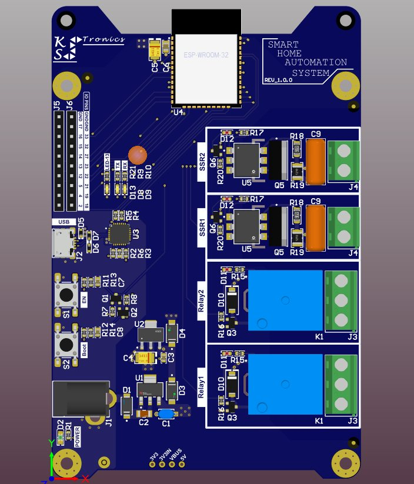
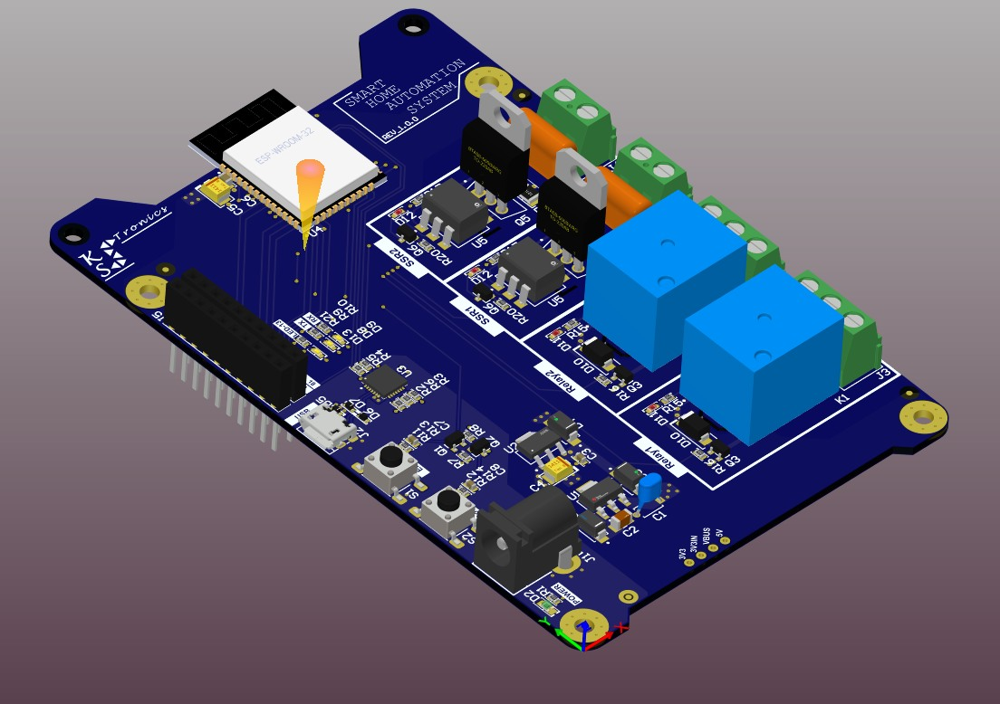

# Smart Home Automation Unit PCB

## Overview
Introducing our latest **Smart Home Automation Unit PCB** design! This board enables seamless control of home appliances via Wi-Fi, allowing users to manage their devices from anywhere with an internet connection. 

  <table>
    <tr>
      <td align="center"></td>
      <td align="center"></td>
    </tr>
    <tr>
      <td align="center"><b>Top View</b></td>
      <td align="center"><b>Perspective View</b></td>
    </tr>
  </table>

## Features
- **Wi-Fi Connectivity**: Built-in ESP32 module for remote control.
- **Four Channels**: Control up to four different appliances.
  - **2 Relay Channels**: For high-power AC devices.
  - **2 Triac Channels**: For dimmable or solid-state switching.
- **Customizable**: Modify configurations based on user preferences.
- **Easy Installation**: Simple setup process for seamless integration.

## Usage
- Control lights, fans, and appliances remotely.
- Automate schedules and routines for efficiency.
- Monitor and manage energy consumption.

---

This project is open-source. Feel free to contribute, modify, and enhance the design! 🚀
